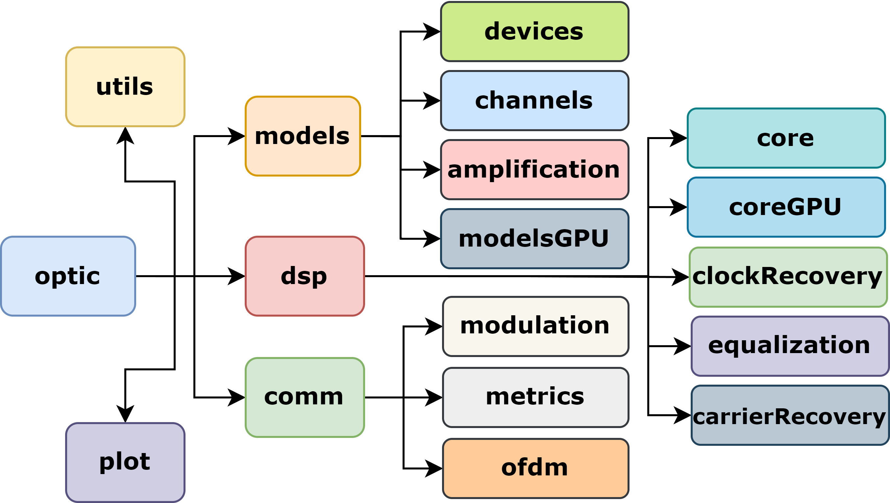

# Summary
OptiCommPy, an open-source Python package designed for simulating optical communication systems and subsystems. OptiCommPy is freely accessible, providing researchers, students, and engineers with the option to simulate various optical communication systems at the physical layer. Additionally, the toolbox incorporates numerous digital signal processing (DSP) algorithms, particularly essential for coherent optical systems.

# Statement of need

Optical fiber communication dominates the transmission of high-speed data traffic, owing to various physical, engineering, and economic factors. Worldwide efforts are continuously being made to research and develop optical communication technologies that can support both current and future Internet infrastructure. The expansion of optical networks necessitates a swift transition from scientific breakthroughs in research labs to telecommunications industry products and solutions. Furthermore, the ever-increasing demand for bandwidth and connectivity places constant pressure on the development of faster and more efficient optical fiber communications [@Winzer2017].

Today, optical communication systems engineering is a multidisciplinary field encompassing various areas of science and technology, including laser science, photonic devices, fiber optics modeling and engineering, digital signal processing, and communications theory. As we approach the limits of information transmission through optical fibers, more sophisticated engineering is required for the construction of optical transmitters and receivers, involving advanced digital signal processing (DSP) [@Essiambre2010], [@Savory2010]. The emergence of high-speed application-specific integrated circuits (ASICs) and advanced DSP algorithms has propelled coherent optical transmission systems to the forefront of high-capacity transmission via optical fibers [@Sun2020].

Whether in the research or development stages, the study of optical communication systems typically necessitates the use of robust computational models to simulate various aspects of the system. For instance, it may be essential to comprehend how information-carrying signals transmitted over fibers will be affected by propagation phenomena such as chromatic dispersion (CD), polarization mode dispersion (PMD), nonlinear effects, and noise [@Agrawal2002]. This information ultimately determines the performance metrics of the transmission system, which play a crucial role in selecting the most suitable technology to become an industrial standard.

Presently, a variety of optical communication simulation toolboxes are accessible. While the majority of these are proprietary software packages [@OptiSystem], [@vpi], [@optsim], a few are open-source but are designed to operate within proprietary software environments such as Matlab&reg;
[@robochameleon], [@optilux].

The module structure of the OptiCommPy package is illustrated in Fig. 1. At the top level, the package is named `optic`, containing five sub-packages: `comm, models, dsp, utils`, and `plot`.

The `comm` sub-package comprises three modules designed for implementing various digital modulation and demodulation schemes [@Proakis2001], including pulse amplitude modulation (PAM), quadrature amplitude modulation (QAM), phase-shift keying (PSK), and on-off keying (OOK). Evaluating the performance of these diverse digital communication schemes is made possible through different metrics, such as bit-error-rate (BER), symbol-error-rate (SER), error vector magnitude (EVM), mutual information (MI), and generalized mutual information (GMI) [@Alvarado2018], all available within the `comm.metrics` module.

The `models` sub-package contains the majority of the mathematical/physical models used to build OptiCommPy simulations. Within the `models.devices` module, one can access models for a range of optical devices, encompassing optical Mach-Zehnder modulators, photodiodes, optical hybrids, optical coherent receivers, and more. These functions serve as fundamental building blocks for constructing simulations of optical transmitters and receivers. In the `models.channels` module, a collection of mathematical models for the fiber optic channel is provided, spanning from basic additive white Gaussian noise (AWGN) and linear propagation models to more sophisticated non-linear propagation models rooted in variants of the split-step Fourier method (SSFM)[@Agrawal2002]. In particular, it includes an implementation of the Manakov model to simulate nonlinear transmission over a fiber optic channel with polarization-multiplexing [@Marcuse1997a]. Certain computationally intensive models, such as the Manakov SSFM, have a CuPy-based version [@cupy_learningsys2017] accessible via `models.modelsGPU`, designed specifically for execution with CUDA GPU acceleration [@cuda].

The `dsp` sub-package is a collection of DSP algorithms ranging from basic signal processing operations, such as linear finite impulse response filtering, to more advanced algorithms, e.g. blind adaptive equalization. Currently, the `dsp` sub-package contains three specialized modules: `dsp.clockRecovery` provides algorithms for clock and timing synchronization; `dsp.equalization` contains implementations of common digital equalization algorithms used in optical communications; `dsp.carrierRecovery` provides algorithms for carrier frequency and phase recovery. These sub-packages covers all the basic DSP functionalities required in most of the modern coherent optical transceivers.

Finally, the `utils` and the `plot` sub-packages provide functions that implement a few general utilities and custom plotting functions to visualize signals (eyediagram plots, constellation plots, etc).

Several types of analysis can be conducted to characterize transmission performance across various system parameters. For instance, one can generate performance curves that depict BER and Q-factor as functions of received optical power at varying transmission distances, as illustrated in Fig.~3. 

A collection of examples of utilization of OptiCommPy to build several different simulation setups, including advanced setups with non-linear fiber propagation models, WDM transmission, and coherent detection can be found in https://github.com/edsonportosilva/OptiCommPy/tree/main/examples.

# Conclusions
OptiCommPy is an open-source Python package that serves as a versatile tool for simulating optical communication systems at the physical layer. It facilitates the study of advanced DSP algorithms crucial for coherent optical systems. Through a basic IM/DD optical transmission setup, we demonstrated its practical application. The example simulated a 10 Gb/s NRZ OOK optical transmission over a 100 km fiber optic channel with direct detection. We analyzed the system's performance, revealing the impact of parameters such as transmission distance and photodiode noise. This software allows for in-depth analysis, enabling researchers and engineers to explore and optimize optical communication technologies. The transition from research to telecommunications products continues to be a crucial facet of the ever-evolving optical communication field. OptiCommPy provides a valuable platform to bridge the gap, contributing to the development of faster, more efficient optical fiber communications.

# Acknowledgements

# References